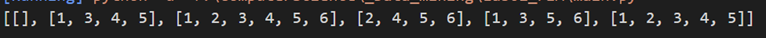
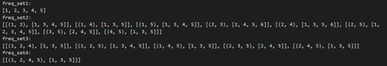
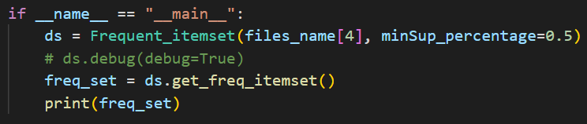
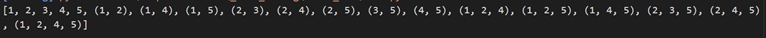
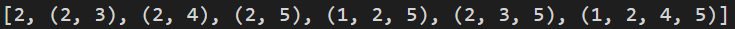
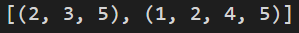

# Frequent itemset (Apriori Algorithm)

---

## Description

- Small project written in Python to find frequent itemset using Apriori algorithm.
- 3rd-year project in _Data Mining_ class.

---

## Table of Contents

- Read data;
- Find Frequent itemset;
- Find Closed Frequent itemset;
- Find Maximal Frequent itemset.

---

## How to Install and Run the Project

| File                | Note                                                            |
| ------------------- | --------------------------------------------------------------- |
| Frequent_itemset.py | Contains class for data structure and processing                |
| utility.py          | Contains functions working on data structure                    |
| main.py             | Contains **main** function                                      |
| data folder         | Contains _"simple_text.txt"_ for debugging, others for analysis |

Data file Description:

- Get data from this [link](https://www.philippe-fournier-viger.com/spmf/index.php?link=datasets.php#:~:text=used%20in%20SPMF%3A-,Dataset%20name,-Description "An Open-Source Data Mining Library").
- Each rows is one transaction.
- Items in each transaction are numbers (because comparing number is faster than string).
- I will use _"simple_text.txt"_ as an example:

| No. Transaction | Items     |
| --------------- | --------- |
| 1               | 1 2 4 5   |
| 2               | 2 3 5     |
| 3               | 1 2 4 5   |
| 4               | 1 2 3 5   |
| 5               | 1 2 3 4 5 |
| 6               | 2 3 4     |

---

---

# Detail

## 1. Read the data

```python
#in "Frequent_itemset.py" file
def __init__(self, file_name: str, minSup: int = None, minSup_percentage: float = None)
```

#### 1.1 Explanation

`file_name`
: read the filename and save it into `dataset`. We also need to transform this into `tidset` for traversing one time only (Time complexity O(n)) when finding frequent itemset. Then, we are not going to use `dataset` anymore!

`minSup`
: minimum support - _minimum number of transactions_. If you use this parameter, don't use `minSup_percentage` and vice versa.

`minSup_percentage`
: 0 <= value <= 1, another parameter to replace `minSup`.

#### 1.2 Example

```python
#in "main.py" file
ds = Frequent_itemset("simple_text.txt", minSup_percentage=0.5)
```

- How to calculate `minSup`: Num-transactions _ minSup_percentage (6 _ 0.5 = 3). Every itemsets has minSup >= 3 will be put in `freq_itemset`
- `print(ds.tidset)` from `main.py`, we get:
  
  - No index 0.
  - Index 1 `[1, 3, 4, 5]`: item 1 appears in transaction number 1, 3, 4 and 5.

## 2. Turn on debug

To see how it works!

```python
#in "main.py" file
ds.debug(debug=True)
```

## 3. Find Frequent itemset

We will explain the algorithm in `def get_freq_itemset(self)`

#### 3.1 Pseudocode:

```python
#in "Frequent_itemset.py" file
def get_freq_itemset(...):
    freq_set1 = Create_freq_set_with_1_item(tidset)
    if freq_set1.isEmpty():
        return

    freq_set2 = Create_freq_set_with_1_item(freq_set1)
    if freq_set2.isEmpty():
        return

    while True:
        freq_set_n+1 = Create_freq_set_with_n_item(freq_set_n)
        if freq_set_n+1.isEmpty():
            return

#return intersection of freq_set1, freq_set2,..., freq_set_n
```

#### 3.2 Result



`freq_set4` has `[[(1, 2, 4, 5), [1, 3, 5]]]` means this set contains 4 items (1, 2, 4 and 5), these 4 items happened to appear in transaction No. 1, 3 and 5.

#### 3.3 More about `debug = True`

- We only use this var for above purpose. When we use other functions, we need to run the program with default `debug = False`.
- This happened due to inconsistent data structure.



- When we turn this var off, we will get the result directly. It's the same value as before but different in data structure.
  

## 4. Find Closed Frequent itemset

```python
#in "Frequent_itemset.py" file
def get_closed_pattern()
```



## 5. Find Maximal Frequent itemset

```python
#in "Frequent_itemset.py" file
def get_max_pattern() -> list
```


